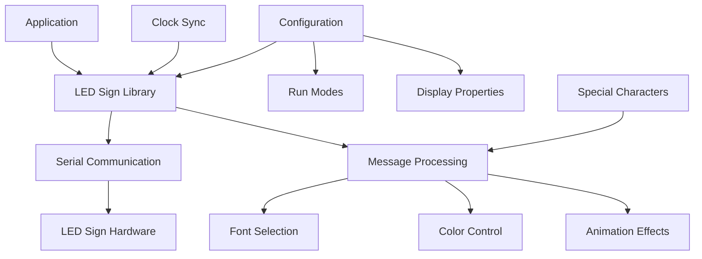

# LED Sign Control Library

A collection of libraries and scripts for interfacing with programmable LED signs, specifically designed for scrolling message displays commonly used in retail, offices, and public spaces.

## 🎯 Interactive Demos

Experience the LED sign system with our interactive demonstrations:

- **[🎨 Animated Architecture Diagram](docs/animated-architecture.html)** - Interactive 3D system overview with floating animations
- **[💻 Live Code Demo](docs/interactive-code-demo.html)** - Run C# and Perl examples with simulated LED output

## Overview

This repository contains multiple implementations for controlling LED signs:

- **SerialLEDSign.cs**: C# library for serial communication with LED signs
- **signControl.pl**: Perl script for command-line control of LED signs

## Supported Hardware

The libraries are designed to work with serial-controlled LED signs similar to:
- Programmable LED scrolling message signs (7x80 pixel displays)
- Signs with RS232/USB serial interfaces
- Display boards with configurable run modes and text effects

## Features

- **Multiple Run Modes**: Static display, scrolling, blinking, and animation effects
- **Font Control**: Various font sizes (5x5, 10x5, 5x7, 10x7, 8x7, 16x7)
- **Color Support**: Red, multi-color displays with brightness control
- **Special Effects**: Built-in animations for holidays and special messages
- **Clock Display**: Real-time clock synchronization
- **Serial Communication**: Configurable baud rates and port settings

## Quick Start

### C# Library Usage
```csharp
using MySign;

// Initialize connection
SerialLEDSign sign = new SerialLEDSign("COM1");

// Display a message
sign.println("Hello World!");

// Set clock to current time
sign.setTimeToCurrentTime();

// Clean up
sign.close();
```

### Perl Script Usage
```bash
# Send message to LED sign
./signControl.pl "Your message here"
```

## System Architecture



> 💡 **Note**: For a fully interactive animated version of this diagram, check out our [animated architecture visualization](docs/animated-architecture.html)!

## Configuration Options

### Run Modes
- **Static (0x2)**: Display message without scrolling
- **Scroll (0x1-0x19)**: Various scrolling speeds and directions
- **Cycle**: Rotate through multiple messages

### Display Properties
- **Fonts**: 5x5, 10x5, 5x7, 10x7, 8x7, 16x7 pixel fonts
- **Colors**: Bright red, multi-color support
- **Speed**: Configurable scroll speeds (0xC0-0xC7)
- **Pause**: Adjustable pause times between messages

### Special Features
- Holiday animations (Christmas, New Year, Halloween, etc.)
- Welcome messages and warnings
- Date and time display synchronization

## Hardware Setup

1. Connect LED sign to computer via serial cable (RS232 or USB-to-serial)
2. Configure serial port settings:
   - Baud rate: 2400
   - Data bits: 8
   - Stop bits: 1
   - Parity: None
3. Identify the correct COM port (Windows) or device (Linux/Mac)

## Protocol Details

The LED sign communication protocol uses a specific byte sequence:
- Header: Start bytes and configuration
- File name: Message identifier
- Run mode: Display behavior
- Properties: Font, color, effects
- Message: Actual text content
- Footer: End frame markers

For detailed protocol information, see the source code comments and `Proto-7x80.doc`.

## Development

### Requirements
- **C# Version**: .NET Framework with System.IO.Ports support
- **Perl Version**: Standard Perl installation with basic modules

### Testing
Test your setup with a simple message before implementing complex features:
```bash
# Linux/Mac: Configure serial port
stty 2400 -opost -ocrnl -onlcr cs8 parenb -parodd stop 0 < /dev/ttyUSB0

# Send test message
./signControl.pl "TEST MESSAGE"
```

> 🚀 **Try it interactively**: Use our [live code demo](docs/interactive-code-demo.html) to see how the commands work!

## Troubleshooting

**Common Issues:**
- **Port Access**: Ensure proper permissions for serial port access
- **Baud Rate**: Verify the LED sign supports 2400 baud
- **Cable**: Check that the serial cable is properly connected and functional
- **Message Length**: Very long messages may override run mode settings

## Contributing

Contributions are welcome! Please:
1. Fork the repository
2. Create a feature branch
3. Make your changes
4. Test with actual LED sign hardware if possible
5. Submit a pull request

## License

This project is open source. Please check individual file headers for specific licensing information.

## Resources

- **Interactive Demos**: 
  - [Animated Architecture](docs/animated-architecture.html) - 3D system visualization
  - [Code Demo](docs/interactive-code-demo.html) - Live C# and Perl examples
- **Protocol documentation**: See `Proto-7x80.doc` for detailed technical specifications
- **Hardware vendors**: Search for "programmable LED scrolling message sign" or "7x80 LED display"
- **Serial communication**: Ensure your system has appropriate serial drivers installed